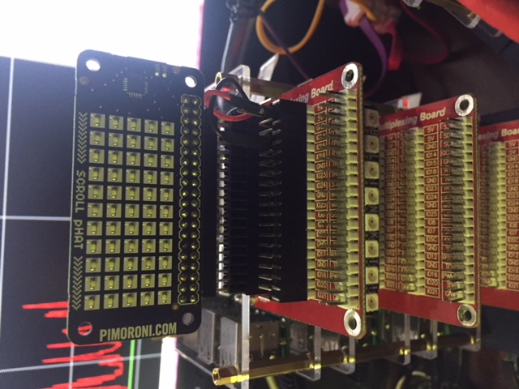
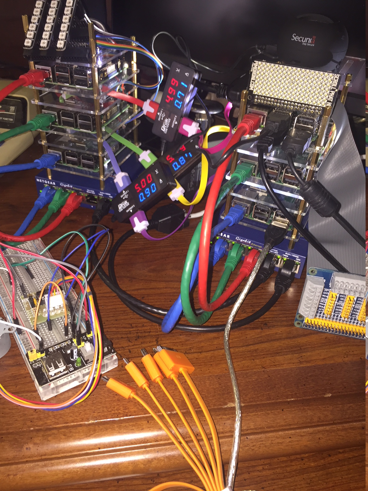

# pi-display

This repository contains shell scripts and python for RaspBerry Pi display project.  The displays are Pimoroni Blinkt, Scroll-pHAT, and Scroll-pHAT-HD connected to Raspberry Pi 3 using Triple GPIO Multiplexing Expansion Board. 

#### WARNING: These instructions are incomplete. Consider them as notes quickly drafted on a napkin rather than proper documentation!

#### To watch futre updates in this repository select in the upper-right corner, the "Watch" list, and select Watching. 

 * [scroll-phat](https://github.com/BradleyA/pi-display-board/tree/master/scroll-phat) 
 * scrollphathd
 * [blinkt](https://github.com/BradleyA/pi-display-board/tree/master/blinkt)
 
 

----> 

I need to get this to work and completed then some cleanup before it is shareable and documented . . .

### Install

### Clone

To install, change directory to the location you want to download the scripts. Use git to pull or clone these scripts into the directory. If you do not have git then enter; "sudo apt-get install git". On the github page of this script use the "HTTPS clone URL" with the 'git clone' command.

    git clone https://github.com/BradleyA/pi-display
    cd pi-display

### System OS script tested

 * Ubuntu 16.04.3 LTS (armv7l)

### Design Principles
 * Have a simple setup process and a minimal learning curve
 * Be usable as non-root
 * Be easy to install and configure

### License::

Permission is hereby granted, free of charge, to any person obtaining a copy of this software, associated documentation, and files (the "Software") without restriction, including without limitation of rights to use, copy, modify, merge, publish, distribute, sublicense, and/or sell copies of the Software, and to permit persons to whom the Software is furnished to do so.

THE SOFTWARE IS PROVIDED "AS IS", WITHOUT WARRANTY OF ANY KIND, EXPRESS OR IMPLIED, INCLUDING BUT NOT LIMITED TO THE WARRANTIES OF MERCHANTABILITY, FITNESS FOR A PARTICULAR PURPOSE. IN NO EVENT SHALL THE AUTHORS BE LIABLE FOR ANY CLAIM, DAMAGES OR OTHER LIABILITY, WHETHER IN AN ACTION OF CONTRACT, TORT OR OTHERWISE, ARISING FROM, OUT OF OR IN CONNECTION WITH THE SOFTWARE OR THE USE OR OTHER DEALINGS IN THE SOFTWARE.
